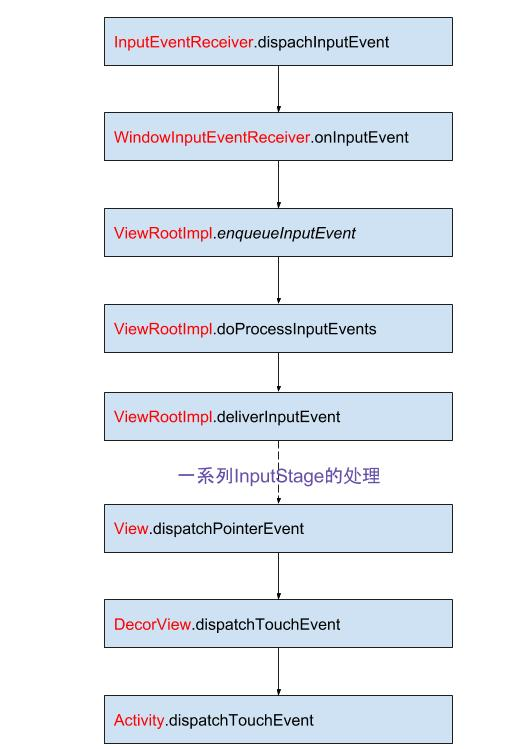
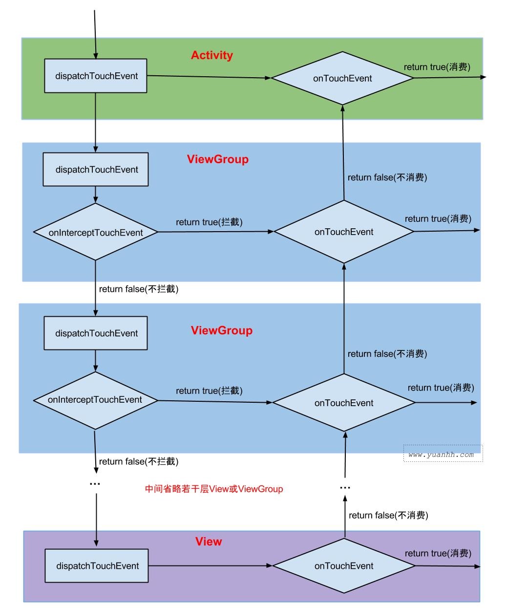

# 第 3 章 View 的事件体系

## 3.1 View 基础知识

### 3.1.1 什么是 View

**注意** ViewGroup 也是继承自 View 。

### 3.1.2 View 的位置参数

View 的位置主要由四个顶点决定，分别对应于 View 的四个属性 top ， left ，right ，bottom ，要注意的是这四个参数都是 View 相对于父容器来说的。这样我们就可以轻松计算出 View 的 width = right - left ， height = bottom - top ；另外这四个属性可以用下面的方法获得：

```java
top = getTop() ;
left = getLeft() ;
right = getRight() ;
bottom = getBottom() ;
```

从 Android 3.0 开始，View 额外增加了几个参数： x 、 y 、 translationX 和 translationY ，这四个属性也是 View 相对于父容器的。其中 translationX 和 translationY 是 View 平移后相对于初始位置的偏移量，其关系如下：

```java
x = left + translationX ;
y = top + translationY ;
```

**注意** 在 View 平移过程中 top ， left ，right ，bottom 不会改变，变的是 x 、 y 、 translationX 和 translationY 。

### 3.1.3 MotionEvent 和 TouchSlop

#### 3.1.3.1 MotionEvent

手指接触到屏幕的一系列事件中，典型的有如下几种：

1. ACTION_DOWN 手指刚接触屏幕；
2. ACTION_MOVE 手指在屏幕上移动；
3. ACTION_UP 手指从屏幕松开的一瞬间；

正常情况下，一次手指触摸屏幕的行为会触法一系列点击事件，例如下面几种情况：

1. 点击屏幕后离开松开，事件序列为 DOWN -> UP ;
2. 点击屏幕滑动一会再松开，事件序列为 DOWN -> MOVE -> ... -> MOVE -> UP ;

触摸时我们可以根据 MotionEvent 对象获得点击事件发生的 x ，y 坐标，系统提供了两组方法： getX / getY 和 getRawX / getRawY , getX / getY 返回的是相对于当前 View 左上角的 x ，y 坐标，getRawX / getRawY 返回的是相对于屏幕左上角的 x ，y 坐标。

#### 3.1.3.2 TouchSlop

TouchSlop 系统所能识别出的被认为是滑动的最小距离，这是一个常量，和设备有关，不同的设备可能取值不同，可以通过 ViewConfiguration.get(getContext()).getScaledTouchSlop() 获得。

### 3.1.4 VelocityTracker 、 GestureDetector 和 Scroller

#### 3.1.4.1 VelocityTracker

速度追踪，用于追踪手指在滑动过程中的速度，包括水平速度和竖直速度，它的使用如下：

```java
 VelocityTracker velocityTracker = VelocityTracker.obtain() ;
 velocityTracker.add(onTouchEvent) ;// 追踪 View 的事件
 velocityTracker.computeCurrentVelocity(1000) ;// 设置间隔时间
 int xVelocity = velocityTracker.getXVelocity() ;
 int yVelocity = velocityTracker.getYVelocity() ;
 // 不使用时重置并回收内存
 velocityTracker.clear() ;
 velocityTracker.recycle() ;
```

这里的速度是指一段时间内手指所划过的像素数，因为屏幕坐标系的存在，所以速度可以为负。

#### 3.1.4.2 GestureDetector

手势检测，用于辅助检测用户的单击、滑动、长按、双击等行为。使用方法如下：

```java
 GestureDetector mGestureDetector = new GestureDetector(this) ;
 // 解决长按屏幕后无法拖动的现象
 mGestureDetector.setIsLongpressEnabled(false) ;
```

未完 待续

#### 3.1.4.3 Scroller

弹性滑动对象，用于实现 View 的弹性滑动。

## 3.2 View 的滑动

### 3.2.1 使用 scrollTo / scrollBy

scrollBy 实际上也是调用了 scrollTo 方法，它实现了基于当前位置的相对滑动，而 scrollTo 则实现了基于所传递参数的绝对滑动。View 内部有 2 个属性 mScrollX 和 mScrollY ，可分别通过 getScrollX 和 getScrollY 获得。在滑动过程中 mScrollX 的值总是等于 View 左边缘和 View 内容左边缘在水平方向的距离，而 mSrollY 的值总是等于 View 上边缘和 View 内容上边缘在竖直方向的距离。View 边缘指的是 View 的位置，由四个顶点组成，而 View 内容边缘是指 View 中的内容的边缘，scrollTo 和 scrollBy 只能改变 View 内容的位置而不能改变 View 在布局中的位置。mScrollX 和 mScrollY 的单位是像素，正负代表 View 内容移动的方向，右下为正，左上为负。

### 3.2.2 使用动画

通过动画我们能让一个 View 进行平移，而平移是一种滑动。使用动画来移动 View ，主要是操作 View 的 translationX 和 translationY 属性，既可以采用传统的 View 动画，也可以采用属性动画，如果采用属性动画的话，为了能兼容 3.0 以下的版本，需要采用开源动画库 [nineoldandroids](http://nineoldandroids.com/)。

View 动画是对 View 的影像做操作，它不能真正改变 View 的位置参数，包括宽/高，并且如果希望动画后的状态得以保留还必须将 fillAfter 属性设置为 true ，否则动画完成后期动画结果会消失。使用属性动画则不为存在这种问题，但是在 Android 3.0 以下无法使用属性动画，这个时候我们可以使用动画兼容库 nineoldandroids 来实现属性动画，尽管如此，在 Android 3.0 以下的手机上通过 nineoldandroids 来实现的属性动画本质上仍然是 View 动画。

**注意**：由于 View 动画无法真正改变 View 的位置，当 View 移动后会造成在新位置无法触发 onClick 等事件。

### 3.2.3 改变布局参数

对于 View 的滑动，我们还可以通过 LayoutParams 的 margin 、 width 等来达到移动 View 的效果。

### 3.2.4 各种滑动方式的对比

| - | scrollTo / scrollBy | 动画 | 改变布局参数 |
|------|---------------------| ---- |------------|
| 优点 | 操作简单，不影响内部元素的点击事件 | 操作简单，主要适用于没有交互的 View 和 实现复杂的动画效果 | 适用于有交互的 View |
| 缺点 | 只能滑动 View 内容，不能滑动 View 本身 | Android 3.0 以上使用属性动画没有明显的缺点；如果是使用 View 动画或在 Android 3.0 以下使用属性动画，均不能改变 View 本身的属性；动画元素不适合需要响应用户交互的操作 | 操作稍微复杂 |

## 3.3 弹性动画

弹性动画的实现方式有： Scroller 、 Handler#postDelayed 以及 Thread#sleep 等；它们都有一个共同的思想：将一次大的滑动分为几次小的滑动并在一段时间内完成。

未完待续

## 3.4 View 的事件分发机制

### 3.4.1 事件类型

事件类型事件分发的过程中，MotionEvent 对象记录的触摸事件，例如点击、移动。一次完整的 MotionEvent，包含用户触摸屏幕到离开屏幕。

|事件|发生次数|描述|
|-|-|-|
|ACTION_DOWN|1|手指触摸时触发|
|ACTION_MOVE|1 ~ N|手指在屏幕上滑动时触发|
|ACTION_UP|1|手指离开屏幕时触发|
|ACTION_CANCEL|0 ~ 1|事件被上层拦截时触发|

### 3.4.2 核心方法

时间的分发流程涉及到三个核心方法 ：

1. dispatchTouchEvent(MotionEvent event) // 事件分发
2. onInterceptTouchEvent(MotionEvent ev) // 事件拦截，只有 ViewGroup 有
3. onTouchEvent(MotionEvent event) // 事件响应

事件分发涉及到的类包含 View、ViewGroup 和 Activity 等，他们都能处理触摸事件的分发，但是其方法有些区别。

|方法|View|ViewGroup|Activity|
|-|-|-|-|
|dispatchTouchEvent()|√|√|√|
|onInterceptTouchEvent()|×|√|×|
|onTouchEvent()|√|√|√|

### 3.4.3 分发流程

当 UI 主线程收到底层上报的 input 事件，会调用 InputEventReceiver.dispachInputEvent() 方法。

整个事件分发流程如下图：


DecorView.dispatchTouchEvent()

```java
// DecorView.java
@Override
public boolean dispatchTouchEvent(MotionEvent ev) {
    final Window.Callback cb = mWindow.getCallback();
    return cb != null && !mWindow.isDestroyed() && mFeatureId < 0
            ? cb.dispatchTouchEvent(ev) : super.dispatchTouchEvent(ev);
}
```

Activity 实现了 Window.Callback 接口，所以事件会分发到 Activity.dispatchTouchEvent。

Activity.dispatchTouchEvent()

```java
// Activity.java
public boolean dispatchTouchEvent(MotionEvent ev) {
    if (ev.getAction() == MotionEvent.ACTION_DOWN) {
        // 第一次按下屏幕的方法
        onUserInteraction();
    }
    // PhoneWindow.superDispatchTouchEvent(ev)
    if (getWindow().superDispatchTouchEvent(ev)) {
        return true;
    }
    // 没有 View 处理事件时，调用 Activity.onTouchEvent(ev)
    return onTouchEvent(ev);
}
```

PhoneWindow.superDispatchTouchEvent()

```java
// PhoneWindow.java
public boolean superDispatchTouchEvent(KeyEvent event) {
    return mDecor.superDispatcTouchEvent(event);
}
```

PhoneWindow 的顶层 View 是 DecorView，接着又会调用 DecorView 的 superDispatcTouchEvent() 方法，在 DecorView 中又调用了父类的 dispatchTouchEvent() 方法。

```java
// DecorView.java
public boolean superDispatchTouchEvent(MotionEvent event) {
    return super.dispatchTouchEvent(event);
}
```

DecorView 的父类为 ViewGroup，接着会调用 ViewGroup 的 dispatchTouchEvent() 方法。

ViewGroup.dispatchTouchEvent()

```java
// ViewGroup.java
public boolean dispatchTouchEvent(MotionEvent ev) {
    // ...
    boolean handled = false;
    //根据隐私策略而来决定是否过滤本次触摸事件,
    if (onFilterTouchEventForSecurity(ev)) {
        final int action = ev.getAction();
        final int actionMasked = action & MotionEvent.ACTION_MASK;

        if (actionMasked == MotionEvent.ACTION_DOWN) {
            // 发生ACTION_DOWN事件, 则取消并清除之前所有的触摸targets
            cancelAndClearTouchTargets(ev);
            resetTouchState(); // 重置触摸状态
        }

        // 发生ACTION_DOWN事件或者已经发生过ACTION_DOWN;才进入此区域，主要功能是拦截器
        //只有发生过ACTION_DOWN事件，则mFirstTouchTarget != null;
        final boolean intercepted;
        if (actionMasked == MotionEvent.ACTION_DOWN
                || mFirstTouchTarget != null) {
            //可通过调用requestDisallowInterceptTouchEvent，不让父View拦截事件
            final boolean disallowIntercept = (mGroupFlags & FLAG_DISALLOW_INTERCEPT) != 0;
            //判断是否允许调用拦截器
            if (!disallowIntercept) {
                //调用拦截方法
                intercepted = onInterceptTouchEvent(ev);
                ev.setAction(action);
            } else {
                intercepted = false;
            }
        } else {
            // 当没有触摸targets，且不是down事件时，开始持续拦截触摸。
            intercepted = true;
        }
        ...

        //不取消事件，同时不拦截事件, 并且是Down事件才进入该区域
        if (!canceled && !intercepted) {
            //把事件分发给所有的子视图，寻找可以获取焦点的视图。
            View childWithAccessibilityFocus = ev.isTargetAccessibilityFocus()
                    ? findChildWithAccessibilityFocus() : null;

            if (actionMasked == MotionEvent.ACTION_DOWN
                    || (split && actionMasked == MotionEvent.ACTION_POINTER_DOWN)
                    || actionMasked == MotionEvent.ACTION_HOVER_MOVE) {
                final int actionIndex = ev.getActionIndex(); // down事件等于0
                final int idBitsToAssign = split ? 1 << ev.getPointerId(actionIndex)
                        : TouchTarget.ALL_POINTER_IDS;

                removePointersFromTouchTargets(idBitsToAssign); //清空早先的触摸对象

                final int childrenCount = mChildrenCount;
                //第一次down事件，同时子视图不会空时
                if (newTouchTarget == null && childrenCount != 0) {
                    final float x = ev.getX(actionIndex);
                    final float y = ev.getY(actionIndex);
                    // 从视图最上层到下层，获取所有能接收该事件的子视图
                    // 获取一个视图组的先序列表，通过虚拟的Z轴来排序。
                    final ArrayList<View> preorderedList = buildOrderedChildList();
                    final boolean customOrder = preorderedList == null
                            && isChildrenDrawingOrderEnabled();
                    final View[] children = mChildren;

                    /* 从最底层的父视图开始遍历，
					** 找寻newTouchTarget，并赋予view与 pointerIdBits；
					** 如果已经存在找寻newTouchTarget，说明正在接收触摸事件，则跳出循环。 
					*/
                    for (int i = childrenCount - 1; i >= 0; i--) {
                        final int childIndex = customOrder
                                ? getChildDrawingOrder(childrenCount, i) : i;
                        final View child = (preorderedList == null)
                                ? children[childIndex] : preorderedList.get(childIndex);

                        // 如果当前视图无法获取用户焦点，则跳过本次循环
                        if (childWithAccessibilityFocus != null) {
                            if (childWithAccessibilityFocus != child) {
                                continue;
                            }
                            childWithAccessibilityFocus = null;
                            i = childrenCount - 1;
                        }
                        //如果view不可见，或者触摸的坐标点不在view的范围内，则跳过本次循环
                        if (!canViewReceivePointerEvents(child)
                                || !isTransformedTouchPointInView(x, y, child, null)) {
                            ev.setTargetAccessibilityFocus(false);
                            continue;
                        }

                        newTouchTarget = getTouchTarget(child);
                        // 已经开始接收触摸事件,并退出整个循环。
                        if (newTouchTarget != null) {
                            newTouchTarget.pointerIdBits |= idBitsToAssign;
                            break;
                        }

                        //重置取消或抬起标志位
                        //如果触摸位置在child的区域内，则把事件分发给子View或ViewGroup
                        if (dispatchTransformedTouchEvent(ev, false, child, idBitsToAssign)) {
                            // 获取TouchDown的时间点
                            mLastTouchDownTime = ev.getDownTime();
                            // 获取TouchDown的Index
                            if (preorderedList != null) {
                                for (int j = 0; j < childrenCount; j++) {
                                    if (children[childIndex] == mChildren[j]) {
                                        mLastTouchDownIndex = j;
                                        break;
                                    }
                                }
                            } else {
                                mLastTouchDownIndex = childIndex;
                            }

                            //获取TouchDown的x,y坐标
                            mLastTouchDownX = ev.getX();
                            mLastTouchDownY = ev.getY();
                            //添加TouchTarget,则mFirstTouchTarget != null。
                            newTouchTarget = addTouchTarget(child, idBitsToAssign);
                            //表示以及分发给NewTouchTarget
                            alreadyDispatchedToNewTouchTarget = true;
                            break;
                        }
                        ev.setTargetAccessibilityFocus(false);
                    }
                    // 清除视图列表
                    if (preorderedList != null) preorderedList.clear();
                }

                if (newTouchTarget == null && mFirstTouchTarget != null) {
                    //将mFirstTouchTarget的链表最后的touchTarget赋给newTouchTarget
                    newTouchTarget = mFirstTouchTarget;
                    while (newTouchTarget.next != null) {
                        newTouchTarget = newTouchTarget.next;
                    }
                    newTouchTarget.pointerIdBits |= idBitsToAssign;
                }
            }
        }

        // mFirstTouchTarget赋值是在通过addTouchTarget方法获取的；
        // 只有处理ACTION_DOWN事件，才会进入addTouchTarget方法。
        // 这也正是当View没有消费ACTION_DOWN事件，则不会接收其他MOVE,UP等事件的原因
        if (mFirstTouchTarget == null) {
            //没有触摸target,则由当前ViewGroup来处理
            handled = dispatchTransformedTouchEvent(ev, canceled, null,
                    TouchTarget.ALL_POINTER_IDS);
        } else {
            //如果View消费ACTION_DOWN事件，那么MOVE,UP等事件相继开始执行
            TouchTarget predecessor = null;
            TouchTarget target = mFirstTouchTarget;
            while (target != null) {
                final TouchTarget next = target.next;
                if (alreadyDispatchedToNewTouchTarget && target == newTouchTarget) {
                    handled = true;
                } else {
                    // 如果ViewGroup拦截了事件，则会向子View分发ACTION_CANCEL事件
                    final boolean cancelChild = resetCancelNextUpFlag(target.child)
                            || intercepted;
                    if (dispatchTransformedTouchEvent(ev, cancelChild,
                            target.child, target.pointerIdBits)) {
                        handled = true;
                    }
                    if (cancelChild) {
                        if (predecessor == null) {
                            mFirstTouchTarget = next;
                        } else {
                            predecessor.next = next;
                        }
                        target.recycle();
                        target = next;
                        continue;
                    }
                }
                predecessor = target;
                target = next;
            }
        }

        //当发生抬起或取消事件，更新触摸targets
        if (canceled
                || actionMasked == MotionEvent.ACTION_UP
                || actionMasked == MotionEvent.ACTION_HOVER_MOVE) {
            resetTouchState();
        } else if (split && actionMasked == MotionEvent.ACTION_POINTER_UP) {
            final int actionIndex = ev.getActionIndex();
            final int idBitsToRemove = 1 << ev.getPointerId(actionIndex);
            removePointersFromTouchTargets(idBitsToRemove);
        }
    } //此处大括号，是if (onFilterTouchEventForSecurity(ev))的结尾

    //通知verifier由于当前时间未处理，那么该事件其余的都将被忽略
    if (!handled && mInputEventConsistencyVerifier != null) {
        mInputEventConsistencyVerifier.onUnhandledEvent(ev, 1);
    }
    return handled;
}
```

其中 onInterceptTouchEvent() 方法可以实当前 ViewGroup 拦截事件，阻断事件分发流程。

dispatchTransformedTouchEvent()

```java
private boolean dispatchTransformedTouchEvent(MotionEvent event, boolean cancel, View child, int desiredPointerIdBits) {
    final boolean handled;

    // 发生取消操作时，不再执行后续的任何操作
    final int oldAction = event.getAction();
    if (cancel || oldAction == MotionEvent.ACTION_CANCEL) {
        event.setAction(MotionEvent.ACTION_CANCEL);
        if (child == null) {
            handled = super.dispatchTouchEvent(event);
        } else {
            handled = child.dispatchTouchEvent(event);
        }
        event.setAction(oldAction);
        return handled;
    }

    final int oldPointerIdBits = event.getPointerIdBits();
    final int newPointerIdBits = oldPointerIdBits & desiredPointerIdBits;

    //由于某些原因，发生不一致的操作，那么将抛弃该事件
    if (newPointerIdBits == 0) {
        return false;
    }

    //分发的主要区域
    final MotionEvent transformedEvent;
    //判断预期的pointer id与事件的pointer id是否相等
    if (newPointerIdBits == oldPointerIdBits) {
        if (child == null || child.hasIdentityMatrix()) {
            if (child == null) {
                //不存在子视图时，ViewGroup调用View.dispatchTouchEvent分发事件，再调用ViewGroup.onTouchEvent来处理事件
                handled = super.dispatchTouchEvent(event);
            } else {
                final float offsetX = mScrollX - child.mLeft;
                final float offsetY = mScrollY - child.mTop;
                event.offsetLocation(offsetX, offsetY);
                //将触摸事件分发给子ViewGroup或View;
                //如果是ViewGroup，则调用代码(2.1)；
                //如果是View，则调用代码(3.1)；
                handled = child.dispatchTouchEvent(event);

                event.offsetLocation(-offsetX, -offsetY); //调整该事件的位置
            }
            return handled;
        }
        transformedEvent = MotionEvent.obtain(event); //拷贝该事件，来创建一个新的MotionEvent
    } else {
        //分离事件，获取包含newPointerIdBits的MotionEvent
        transformedEvent = event.split(newPointerIdBits);
    }

    if (child == null) {
        //不存在子视图时，ViewGroup调用View.dispatchTouchEvent分发事件，再调用ViewGroup.onTouchEvent来处理事件
        handled = super.dispatchTouchEvent(transformedEvent);
    } else {
        final float offsetX = mScrollX - child.mLeft;
        final float offsetY = mScrollY - child.mTop;
        transformedEvent.offsetLocation(offsetX, offsetY);
        if (! child.hasIdentityMatrix()) {
            //将该视图的矩阵进行转换
            transformedEvent.transform(child.getInverseMatrix());
        }
        //将触摸事件分发给子ViewGroup或View;
        //如果是ViewGroup，则调用 ViewGroup 的事件分发方法，如果是View，则调用 View 的事件分发方法处理事件
        handled = child.dispatchTouchEvent(transformedEvent);
    }

    //回收transformedEvent
    transformedEvent.recycle();
    return handled;
}
```

该方法是 ViewGroup 真正处理事件的地方，分发子 View 来处理事件，过滤掉不相干的 pointer ids。当子视图为 null 时，MotionEvent 将会发送给该 ViewGroup。最终调用 View.dispatchTouchEvent() 方法来分发事件。

View.dispatchTouchEvent()

```java
// View.java
public boolean dispatchTouchEvent(MotionEvent event) {
    ...

    final int actionMasked = event.getActionMasked();
    if (actionMasked == MotionEvent.ACTION_DOWN) {
        //在Down事件之前，如果存在滚动操作则停止。不存在则不进行操作
        stopNestedScroll();
    }

    // mOnTouchListener.onTouch优先于onTouchEvent。
    if (onFilterTouchEventForSecurity(event)) {
        //当存在OnTouchListener，且视图状态为ENABLED时，调用onTouch()方法
        ListenerInfo li = mListenerInfo;
        if (li != null && li.mOnTouchListener != null
                && (mViewFlags & ENABLED_MASK) == ENABLED
                && li.mOnTouchListener.onTouch(this, event)) {
            result = true; //如果已经消费事件，则返回True
        }
        //如果OnTouch（)没有消费Touch事件则调用OnTouchEvent()
        if (!result && onTouchEvent(event)) {
            result = true; //如果已经消费事件，则返回True
        }
    }

    if (!result && mInputEventConsistencyVerifier != null) {
        mInputEventConsistencyVerifier.onUnhandledEvent(event, 0);
    }

    // 处理取消或抬起操作
    if (actionMasked == MotionEvent.ACTION_UP ||
            actionMasked == MotionEvent.ACTION_CANCEL ||
            (actionMasked == MotionEvent.ACTION_DOWN && !result)) {
        stopNestedScroll();
    }

    return result;
}
```

先由 OnTouchListener.onTouch() 处理事件，如果返回了 true ，表示消费了事件，则不会调用 onTouchEvent() 方法。

若不拦截，继续调用 onTouchEvent() 方法：

```java
// View.java
public boolean onTouchEvent(MotionEvent event) {
    final float x = event.getX();
    final float y = event.getY();
    final int viewFlags = mViewFlags;

    // 当View状态为DISABLED，如果可点击或可长按，则返回True，即消费事件
    if ((viewFlags & ENABLED_MASK) == DISABLED) {
        if (event.getAction() == MotionEvent.ACTION_UP && (mPrivateFlags & PFLAG_PRESSED) != 0) {
            setPressed(false);
        }
        return (((viewFlags & CLICKABLE) == CLICKABLE ||
                (viewFlags & LONG_CLICKABLE) == LONG_CLICKABLE));
    }

    if (mTouchDelegate != null) {
        if (mTouchDelegate.onTouchEvent(event)) {
            return true;
        }
    }

    //当View状态为ENABLED，如果可点击或可长按，则返回True，即消费事件;
    //与前面的的结合，可得出结论:只要view是可点击或可长按，则消费该事件.
    if (((viewFlags & CLICKABLE) == CLICKABLE ||
            (viewFlags & LONG_CLICKABLE) == LONG_CLICKABLE)) {
        switch (event.getAction()) {
            case MotionEvent.ACTION_UP:
                boolean prepressed = (mPrivateFlags & PFLAG_PREPRESSED) != 0;
                if ((mPrivateFlags & PFLAG_PRESSED) != 0 || prepressed) {
                    boolean focusTaken = false;
                    if (isFocusable() && isFocusableInTouchMode() && !isFocused()) {
                        focusTaken = requestFocus();
                    }

                    if (prepressed) {
                        setPressed(true, x, y);
                   }

                    if (!mHasPerformedLongPress) {
                        //这是Tap操作，移除长按回调方法
                        removeLongPressCallback();

                        if (!focusTaken) {
                            if (mPerformClick == null) {
                                mPerformClick = new PerformClick();
                            }
                            //调用View.OnClickListener
                            if (!post(mPerformClick)) {
                                performClick();
                            }
                        }
                    }

                    if (mUnsetPressedState == null) {
                        mUnsetPressedState = new UnsetPressedState();
                    }

                    if (prepressed) {
                        postDelayed(mUnsetPressedState,
                                ViewConfiguration.getPressedStateDuration());
                    } else if (!post(mUnsetPressedState)) {
                        mUnsetPressedState.run();
                    }

                    removeTapCallback();
                }
                break;

            case MotionEvent.ACTION_DOWN:
                mHasPerformedLongPress = false;

                if (performButtonActionOnTouchDown(event)) {
                    break;
                }

                //获取是否处于可滚动的视图内
                boolean isInScrollingContainer = isInScrollingContainer();

                if (isInScrollingContainer) {
                    mPrivateFlags |= PFLAG_PREPRESSED;
                    if (mPendingCheckForTap == null) {
                        mPendingCheckForTap = new CheckForTap();
                    }
                    mPendingCheckForTap.x = event.getX();
                    mPendingCheckForTap.y = event.getY();
                    //当处于可滚动视图内，则延迟TAP_TIMEOUT，再反馈按压状态，用来判断用户是否想要滚动。默认延时为100ms
                    postDelayed(mPendingCheckForTap, ViewConfiguration.getTapTimeout());
                } else {
                    //当不再滚动视图内，则立刻反馈按压状态
                    setPressed(true, x, y);
                    checkForLongClick(0); //检测是否是长按
                }
                break;

            case MotionEvent.ACTION_CANCEL:
                setPressed(false);
                removeTapCallback();
                removeLongPressCallback();
                break;

            case MotionEvent.ACTION_MOVE:
                drawableHotspotChanged(x, y);

                if (!pointInView(x, y, mTouchSlop)) {
                    removeTapCallback();
                    if ((mPrivateFlags & PFLAG_PRESSED) != 0) {
                        removeLongPressCallback();
                        setPressed(false);
                    }
                }
                break;
        }

        return true;
    }
    return false;
}
```

### 3.4.4 总结

整个事件流程如下图：



- onInterceptTouchEvent()返回值 true 表示事件拦截， onTouch() 或 onTouchEvent() 返回值 true 表示事件消费。
- 触摸事件先交由 Activity.dispatchTouchEvent()，再一层层往下分发，当中间的 ViewGroup 都不拦截时，进入最底层的 View 后，开始由最底层的 onTouchEvent() 方法来处理，如果一直不消费，则最后返回到Activity.OnTouchEvent()。
- ViewGroup 才有 onInterceptTouchEvent() 拦截方法。在分发过程中，中间任何一层 ViewGroup 都可以直接拦截，则不再往下分发，而是交由发生拦截操作的ViewGroup的 onTouchEvent() 来处理。
- 子 View 可调用 requestDisallowInterceptTouchEvent() 方法，来设置 disallowIntercept = true，从而阻止父 ViewGroup 的 onInterceptTouchEvent() 拦截操作。
- onTouchEvent() 由下往上冒泡时，当中间任何一层的 onTouchEvent 消费该事件，则不再往上传递，表示事件已处理。
- 如果 View 没有消费 ACTION_DOWN 事件，则之后的 ACTION_MOVE 等事件都不会再接收。
- 只要 View.onTouchEvent()是可点击或可长按，则消费该事件。
- onTouch() 优先于 onTouchEvent() 执行，上面流程图中省略，onTouch() 的位置在 onTouchEvent() 前面。当 onTouch() 返回 true，则不执行 onTouchEvent()，否则会执行 onTouchEvent()。onTouch() 只有 View 设置了OnTouchListener，且是 enable 的才执行该方法。

## 3.5 面试题

**1. 事件一定会经过 Activity 吗？**

不是的。我们的程序界面的顶层 ViewGroup，也就是 DecorView 中注册了 Activity 这个 Callback，所以当程序的主界面接收到事件之后会先交给 Activity。 但是，如果是另外的控件树，如 Dialog、PopupWindow 等事件流是不会经过 Activity 的。只有自己界面的事件才会经 Activity。

**2.Activity的分发方法中调用了 onUserInteraction() 方法，你能说说这个方法有什么作用吗？**

这个方法在 Activity 接收到 ACTION_DOWN 事件的时候会被调用，本身是个空方法，需要开发者自己去重写。 通过官方的注释可以知道，这个方法会在我们以任意的方式开始与 Activity 进行交互的时候被调用。

比较常见的场景就是屏保：当我们一段时间没有操作会显示一张图片，当我们开始与 Activity 交互的时候可在这个方法中取消屏保；另外还有没有操作自动隐藏工具栏，可以在这个方法中让工具栏重新显示。

**3.ViewGroup 是如何分发事件的？**

ViewGroup 处理事件信息分为三个步骤：拦截、寻找子控件、派发事件。

事件分发中有一个重要的规则：一个触控点的一个事件序列只能给一个 View 处理，除非异常情况。所以如果 ViewGroup 消费了 ACTION_DOWN 事件，那么子 View 将无法收到任何事件。

ViewGroup 第一步会判读这个事件是否需要分发给子 View，如果是则调用 onInterceptTouchEvent() 方法判断是否要进行拦截。 第二步是如果这个事件是 ACTION_DOWN 事件，那么需要为他寻找一个消费此事件的子控件，如果找到则为他创建一个 TouchTarget。 第三步是派发事件，如果存在 TouchTarget，说明找到了消费事件序列的子 View，直接分发给他，如果没有则交给自己处理。

**4. 你前面讲到 “一个触控点的一个事件序列只能给一个 View 处理，除非异常情况“，这里有什么异常情况呢？如果发生异常情况该如何处理？**

这里的异常情况主要有两点：

- 被 ViewGroup 拦截
- 出现界面跳转等其他情况

当事件流中断时，ViewGroup 会发送一个 ACTION_CANCEL 事件给到 View，此时需要做一些状态的恢复工作，如终止动画，恢复 View 大小等等。

**5. 事件类型有哪些？**

- ACTION_DOWN：手指接触时产生的事件。
- ACTION_MOVE：手指在屏幕上滑动时产生此事件。
- ACTION_UP：手指抬起时产生此事件。
- ACTION_CANCEL：取消事件。
- ACTION_POINTER_DOWN：当已经有一个手指按下的情况下，另一个手指按下会产生该事件。
- ACTION_POINTER_UP：多个手指同时按下的情况下，抬起其中一个手指会产生该事件。

**6. 你知道 ViewGroup 是如何将多个手指产生的事件准确分发给不同的子 View 吗？**

这个问题的关键在于 MotionEvent 以及 ViewGroup 内部的 TouchTarget。

每个 MotionEvent 中都包含了当前屏幕所有触控点的信息，他的内部用了一个数组来存储不同的触控 id 所对应的坐标数值。

当一个子 View 消费了 ACTION_DOWN 事件之后，ViewGroup 会为该 View 创建一个 TouchTarget，这个TouchTarget 就包含了该 View 的实例与触控 id。这里的触控 id 可以是多个，也就是一个 View 可接受多个触控点的事件序列。

当一个 MotionEvent 到来之时，ViewGroup 会将其中的触控点信息拆开，再分别发送给感兴趣的子 View。从而达到精准发送触控点信息的目的。

**7. 那 View 支持处理多指信息吗？**

View 默认是不支持的。他在获取触控点信息的时候并没有传入触控点索引，也就是获取的是 MotionEvent 内部数组中的第一个触控点的信息。多指需要我们自己去重写方法支持他。

**8. View 是如何处理触摸事件的？**

首先，他会判断是否存在 onTouchListener()，存在则会调用他的 onTouch() 方法来处理事件。如果该方法返回 true 那么就分发结束直接返回。而如果该监听器为 null 或者 onTouch() 方法返回了 false，则会调用 onTouchEvent() 方法来处理事件。

onTouchEvent() 方法中支持了两种监听器：onClickListener () 和 onLongClickListener()。View 会根据不同的触摸情况来调用这两个监听器。同时进入到 onTouchEvent() 方法中，无论该 View 是否是 enable，只要是 clickable，他的分发方法都是返回 true。

总结一下就是：先调用 onTouchListener()，再调用 onClickListener() 和 onLongClickListener()。

**9. 在实际中有运用到事件分发吗？**

第一个需求是要设计一个按钮块。

按下的时候会缩小高度变低同时变得半透明，放开的时候又会回弹。这个时候就可以在这个按钮的 onTouchEvent() 方法中判断事件类型：down 则开启按下动画，up 则开启释放动画。同时注意接收到 cancel 事件的时候要恢复状态。

第二个是滑动冲突。

解决滑动冲突的核心思路就是把滑动事件根据具体的情况分发给 ViewGroup 或者内部 View。主要的方法有外部拦截法和内部拦截法。

外部拦截法的思路就是在 ViewGroup 中判断滑动的情况，对符合自身滑动的事件进行拦截，对不符合的事件不拦截，给到内部 View。
内部拦截法的思路要求 ViewGroup 拦截除了 down 事件以外的所有事件，然后再内部 View 中判断滑动的情况，对符合自身滑动情况的时间设置禁止拦截标志，对不符合自身滑动情况的事件则取消标志让 ViewGroup 进行拦截。

**10. 那外部和内部拦截法该如何选择呢？**

在一般的情况下，外部拦截法不需要对子 View 进行方法重写，比内部拦截法更加简单，推荐使用外部拦截法。

但如果需要在子 View 判断更多的触摸情况时，则使用内部拦截法可更方便子 View 处理情况。