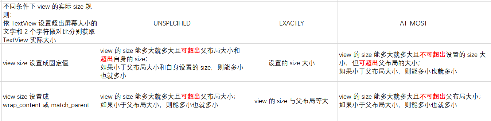

# 第 4 章 View 的工作原理

View 的工作流程，指的就是 measure、layout 和draw。其中，measure 用来测量 View 的宽和高，layout 用
来确定 View 的位置，draw 则用来绘制 View。

## 4.1 初识 ViewRoot 和 DecorView

由于 DecorView 是在新建 Activity 时创建然后加载其它资源。这个时候 DecorView 的内容还无法显示，因为它还没有被加载到Window中。接下来我们来看看DecorView如何被加载到 Window 中。

### 4.1.1 DecorView 被加载到Window中

当 DecorView 创建完毕，要加载到 Window 中时，我们需要先了解一下 Activity 的创建过程。当我们调用
 Activity 的 startActivity 方法时，最终是调用 ActivityThread 的 handleLaunchActivity 方法来创建Activity的，代码如下所示：

 ```java
 private void handleLaunchActivity(ActivityClientRecord r, Intent customIntent) {
	...
	Activity a = perfrmLaunchActivity(r, customIntent);	// 1
	if (a != null ) {
		r.creaatedConfig  = new Configuration(mConfiguration);
		Bundle oldState = r.state;
		handleResumeActivity(r.token, false, r.isForward, !r.activity.mFinished && !r.startsNotResumed);	// 2
	}
	...
 }
 ```

 上面代码注释 1 处调用 performLaunchActivity 方法来创建 Activity，在这里面会调用到 Activity 的 onCreate 方法，从而完成 DecorView 的创建。接着在上面代码注释2处调用
handleResumeActivity 方法，代码如下所示：

```java
final void handleResumeActivity(IBinder token, boolean clearHide, boolean isForward, boolean reallyResume) {
	...
	ActivityClientRecord r = performResumeActivity(token, clearHide);	// 1
	if (r != null) {
		final Activity a = r.activity;
		...
		if (r.window == null && !a.mFinished && willBeVisible) {
			r.window = r.activity.getWindow();
			View decor = r.window.getDecorView(); // 2
			decor.setVisibility(View.INVISIBLE);
			ViewManager vm = a.getWindowManager(); // 3
			WindowManager.LayoutParams l = r.window.getAttributes();
			a.mDecor = decor;
			l.type = WindowManager.LayoutParams.TYPE_BASE_APPLICATION;
			l.softInputMode |= forwardBit;
			if (a.mVisibleFromCliennt) {
				a.mWindowAdded = true;
				wm.addView(decor, l); // 4
			}
		}
	}
}
```

在上面代码注释 1 处的 performResumeActivity 方法中会调用 Activity 的 onResume 方法。接着往下看，注释 2 处得到了 DecorView。注释 3 处得到了WindowManager，WindowManager 是一个接口并且继承了接口 ViewManager。在注释 4 处调用 WindowManager 的 addView 方法，WindowManager  的实现类是 WindowManagerImpl，所以实际调用的是 WindowManagerImpl 的 addView 方法。具体代码如下所示：

```java
public final class WindowManagerImpl implements WindowManager {
	private final WindowManagerGlobal mGlobal = WindowManagerGlobal.getInstance();
	...
	@Override
	public void addView(@NonNull View view, @NonNull ViewGroup.LayoutParams params) {
		...
		applyDefaultToken(params);
		mGlobal.addView(view, params, mDisplay, mParentWindow);
		...
	}
	...
}
```

在 WindowManagerImpl 的 addView 方法中，又调用了 WindowManagerGlobal 的 addView方法，代码如下所示：

```java
public void addView(View view, ViewGroup.LayoutParams params, Display display, Window parentWindow) {
	...
	ViewRootImpl root;
	View panelParentView = null;
	synchronized (mLock) {
		...
		root = new ViewRootImpl(view.getContext(), display); // 1
		view.setLayoutParams(wparams);
		mViews.add(view);
		mRoots.add(root);
		mParams.add(wparams);
	}
	try {
		root.setView(view, wparams, panelParentView); // 2
	} catch (RuntimeException e) {
		...
	}
}
```

在上面代码注释 1 处创建了 ViewRootImpl 实例，在注释 2 处调用了ViewRootImpl 的setView方法并将
DecorView 作为参数传进去，这样就把 DecorView 加载到了 Window 中。当然界面仍不会显示出什么来，因为
View 的工作流程还没有执行完，还需要经过 measure、layout 以及 draw 才会把View绘制出来。

### 4.1.2 ViewRootlmpl 的 performTraveals 方法

前面讲到了将 DecorView 加载到 Window 中，是通过 ViewRootImpl 的 setView 方法。ViewRootImpl 还有一个方法 performTraveals，这个方法使得 ViewTree 开始 View 的工作流程，代码如下所示：

```java
private void performTraversals() {
	...
	if (!mStopped) {
		int childWidthMeasureSpec = getRootMeasureSpec(mWidth, lp.width);
		int childHeightMeasureSpec = getRootMeasureSpec(mHeight, lp.height);
		performMeasure(childWidthMeasureSpec, childHeightMeasureSpec);
	}
	if (didLayout) {
		performLayout(lp, desiredWindowWidth, desiredWindowHeight);
		...
	}
	if (!cancelDraw && !newSurface) {
		...
		performDraw();
	}
}
```

这里面主要执行了 3 个方法，分别是 performMeasure、performLayout 和 performDraw，在其方法的内部又会分别调用 View 的 measure、layout 和 draw 方法。需要注意的是，performMeasure 方法中需要传入两个参数，分别是 childWidthMeasureSpec 和 childHeightMeasureSpec。要了解这两个参数，需要了解MeasureSpec。

### 4.1.2 执行 performTraveals 方法

ViewRootImpl 中有一个 scheduleTraversals 方法，在 ViewRootImpl 调用 setLayout、invalidate、setLayoutParams 等一系列方法时都会调用 scheduleTraversals 方法。代码如下：

```java
void scheduleTraversals() {
	if (!mTraversalScheduled) {
		mTraversalScheduled = true;
		mTraversalBarrier = mHandler.getLooper().getQueue().postSyncBarrier(); // 1
		mChoreographer.postCallback( Choreographer.CALLBACK_TRAVERSAL, mTraversalRunnable, null); // 2
		if (!mUnbufferedInputDispatch) {
			scheduleConsumeBatchedInput();
		}
		notifyRendererOfFramePending();
		pokeDrawLockIfNeeded();
	}
	...
	final class TraversalRunnable implements Runnable {
		@Override
		public void run() {
			doTraversal(); // 3
		}
	}
	final TraversalRunnable mTraversalRunnable = new TraversalRunnable();
}

void doTraversal() {
	if (mTraversalScheduled) {
		mTraversalScheduled = false;
		mHandler.getLooper().getQueue().removeSyncBarrier(mTraversalBarrier);
		if (mProfile) {
			Debug.startMethodTracing("ViewAncestor");
		}
		performTraversals(); // 4
		if (mProfile) {
			Debug.stopMethodTracing();
			mProfile = false;
		}
	}
}
```

上面代码在注释 1 处发送一个同步屏障消息，在注释 2 处通过 Choreographer 接收 Vsync 消息，然后执行注释 3 的 doTraversals 方法，然后就执行到了注释 4 的 performTraversals 方法。

## 4.2 理解 MeasureSpec
### 4.2.1 MeasureSpec
### 4.2.2 MeasureSpec 和 LayoutParams 的对应关系

| 不同条件下 view 的实际 size 规则：依 TextView 设置超出屏幕大小的文字和 2 个字符做对比分别获取 TextView 实际大小 | UNSPECIFIED | EXACTLY | AT_MOST |
|---------------------------------------------------------------------------|--|--|--|
| view size 设置成固定值                                                          | view 的 size 能多大就多大且可超出父布局大小和超出自身的 size；如果小于父布局大小和自身设置的 size，则能多小也就多小 | 设置的 size 大小 | view 的 size 能多大就多大且不可超出设置的 size 大小，但可超出父布局的大小；如果小于父布局大小，则能多小也就多小 |
| view size 设置成 wrap_content 或 match_parent                                 | view 的 size 能多大就多大且可超出父布局大小；如果小于父布局大小，则能多小也就多小 | view 的 size 与父布局等大 | view 的 size 能多大就多大且不可超出父布局大小；如果小于父布局大小，则能多小也就多小 |

